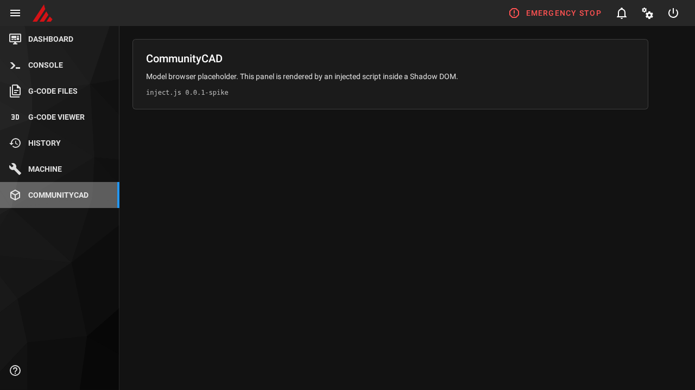

# Can we inject a UI into Mainsail without forking it?

**Verdict: FEASIBLE WITH CAVEATS**

An nginx `sub_filter` that adds one `<script>` tag to Mainsail's `index.html` works. It works
on first visit, on hard reload, through Mainsail's service worker (PWA), across a Mainsail
update, at desktop and phone widths, and uninstalls back to byte-identical stock. Mainsail's
own files are never touched, and a broken, missing or throwing `inject.js` leaves Mainsail
fully working.

The caveats are real, but each one is known and was handled or detected in the prototype:

1. **The service worker keeps serving a stale page unless we also rewrite `sw.js`.** Two
   separate nginx gotchas are involved; both are fixed (criterion A).
2. **`gzip_static` silently disables the injection.** It isn't enabled in any stock setup
   today; the installer detects it (criterion B).
3. **The sidebar hook relies on Vuetify 2 class names.** They're stable for now, but a
   Mainsail move to Vuetify 3 would break them. There's a tested fallback button
   (criterion G).
4. **Reinstalling Mainsail's nginx config with KIAUH will very likely drop our `include`.**
   Production needs a way to detect that and re-apply (see "What production needs").

Tested on 2026-09-22 against Mainsail **v2.17.0** and **v2.19.0** (the latest release),
nginx 1.26.3 from MainsailOS 3.0.0 (Debian 13), and headless Chromium 153. The browser
suite passed **20/20** on each version, and the upgrade test passed **2/2**.

---

## Test setup, and how it differs from the brief

The brief asked for virtual-klipper-printer in Docker. **This Pi has no Docker and no
passwordless sudo**, so I couldn't install Docker or touch `/etc/nginx`. What I did instead,
which exercises the same code paths:

- **This Pi runs MainsailOS 3.0.0** with Klipper, Moonraker, nginx and Mainsail v2.17.0
  already installed. Klipper has no `printer.cfg`, so it sits in an error state, but
  Moonraker and Mainsail work normally. That makes it a stand-in for the virtual printer.
- **`dev/harness.sh` runs a second, unprivileged nginx** on `127.0.0.1:8088`. It uses the
  same `/usr/sbin/nginx` binary and `mime.types`, the upstream MainsailOS site config
  (byte-identical to this Pi's, and to KIAUH's template apart from its placeholders), and a
  copy of a Mainsail release zip. It proxies to the real Moonraker.
- **The real `install.sh`/`uninstall.sh` ran against that sandbox.** Every path and command
  in them can be overridden via environment variables; the harness only changes those.
- **Browser tests used Playwright + headless Chromium.** `127.0.0.1` counts as a secure
  context, so **Mainsail's service worker really installs** during the tests. That
  matters for criterion A.
- **`dev/docker/docker-compose.yml`** is upstream virtual-klipper-printer. It provides
  Moonraker on `:7125`, which the harness already targets. **I could not run it here.**

I did **not** run `install.sh` against this Pi's system nginx (no sudo). README.md has the
steps to do that yourself.

---

## Results

| # | Criterion | Result | Evidence (in `dev/evidence/`) |
|---|---|---|---|
| A | Loads on first visit, hard reload, after SW install | **PASS** (after two fixes) | `v2.1*-log.txt` A1–A6 |
| B | `sub_filter` fires; `gzip_static` check | **PASS** on stock configs; failure reproduced, fix shown | `B-gzip-static.txt` |
| C | Mainsail navigation/routing/Vue unaffected, round trips, no console errors | **PASS** | `v2.1*-log.txt` C1–C8, `*-console.json`, screenshots |
| D | Survives a Mainsail update | **PASS** (v2.17.0 → v2.19.0) | `update-2.17-to-2.19-log.txt` |
| E | Uninstall is byte-for-byte stock | **PASS** | `E-uninstall-idempotency.txt` |
| F | `ngx_http_sub_module` in MainsailOS / KIAUH nginx | **PASS** (present); behaviour without it tested | `F-sub-module.txt` |
| G | DOM dependencies + stability | Assessed; see table | `v2.1*-log.txt` G, section G below |
| — | Failure modes: `inject.js` syntax error / throws / 404 / selectors broken | **PASS**: Mainsail keeps working in all four | `v2.1*-log.txt` F-mode, `*-fallback.png` |

### A. Loading and the service worker: PASS after two fixes

- **First visit, hard reload (A1, A2), SW-served reload and SW-served deep link (A3):** pass.
  The tests confirmed that the navigation response really came from the SW
  (`from_service_worker=True`).
- **Your question: does the SW serve a cached `index.html` that bypasses the injection?
  Yes.** Mainsail's Workbox SW precaches `index.html` under a key built from the stock
  file's hash, and answers **every** navigation from that copy (`NavigationRoute`). nginx
  rewriting `index.html` doesn't change that hash, so:
  - A browser that installed the SW **before** our install keeps showing stock Mainsail
    indefinitely. **Test A4 reproduces this**: still stock after 5 reloads.
  - Symmetrically, a browser that installed it **after** keeps showing the injected page
    after uninstall.
- **Fix 1:** also `sub_filter` Mainsail's `sw.js`, changing
  `{url:"index.html",revision:"<hash>` to `…revision:"ccad1-<hash>`. The browser sees new
  `sw.js` bytes, installs a new worker (Mainsail uses `skipWaiting` + `clientsClaim`), and
  that worker re-precaches the now-injected `index.html`. Uninstall reverts `sw.js` and the
  same thing happens in reverse. The search string is Workbox's manifest format, not a
  version-specific hash.
- **Fix 1 alone did not work (a second gotcha).** Chrome's update check revalidates `sw.js`
  with the stock file's `ETag`/`If-Modified-Since`. nginx answers **`304 Not Modified`**
  from the unchanged file on disk before `sub_filter` ever runs, so the browser never sees
  the rewrite. I confirmed this in the access log.
- **Fix 2:** `location = /sw.js { etag off; if_modified_since off; }`, scoped to `sw.js` only.
- **With both fixes (A5, A6):** a browser with a stale SW recovers **within one reload**,
  in both directions. In a step-by-step trace, the first load after install was stale and
  the second was injected; the old precache entry was cleaned up automatically.
- **Who this affects:** browsers only register service workers in secure contexts (HTTPS or
  `localhost`). A typical user at `http://192.168.x.x` never gets Mainsail's SW, so for them
  this whole issue doesn't exist. It matters for HTTPS reverse-proxy and remote-access
  setups.

### B. `sub_filter` and `gzip_static`: PASS on stock setups; the failure is real and silent

- **Stock is fine.** Neither MainsailOS's nor KIAUH's nginx config enables `gzip_static`,
  and the v2.17.0 and v2.19.0 release zips contain **zero** `.gz` files. The site's
  `gzip on` is harmless: nginx compresses after `sub_filter`, and the injected page is
  served gzipped correctly.
- **Scoping works.** Scoping maps limit the rewrite to exactly `/index.html` and `/sw.js`.
  nginx skips a `sub_filter` pair whose (variable) search string is empty. All **135 other
  text assets** were verified byte-identical to disk with gzip negotiated.
- **The failure, reproduced:** I added `gzip_static on` plus `index.html.gz`/`sw.js.gz`.
  - A gzip-accepting client (every browser) got **no script tag** and an un-rewritten `sw.js`.
  - **`curl` without `Accept-Encoding` still saw the injection.** That's why this is easy to
    miss when debugging from a shell.
- **The fix:** `gzip_static off;` in Mainsail's server scope. Demonstrated: the injection is
  restored. The installer refuses to install when `gzip_static` is on and `.gz` files
  exist, and warns if `gzip_static` is on without them.

### C. Mainsail keeps working: PASS

Checked on both versions:

- **C1:** open our view. The panel shows, Mainsail's page hides, and the URL is unchanged.
- **C2:** leave via the Console item. The router navigates and Console renders its input.
- **C3:** come back to our view, then browser Back leaves it.
- **C4:** clicking the Mainsail item for the *current* route leaves our view. That click
  doesn't change the URL, so it needs its own handling.
- **C5:** after many round trips there is exactly one nav item and one panel.
- **C6:** Shadow DOM isolation holds in both directions:
  - hostile page CSS (`p, h2, .panel { display:none !important; font-size:50px !important }`)
    didn't reach the panel;
  - the panel's CSS didn't reach Mainsail's elements.
- **C7:** **zero console errors and warnings** with the plugin, versus the same load
  sequence on stock (also zero).
- **C8:** phone viewport (see gotchas 5 and 6).

### D. Survives a Mainsail update: PASS

- **The test:** install on v2.17.0, open a browser with an active SW, then replace every
  Mainsail file with the v2.19.0 release, leaving nginx untouched.
- **D1:** the served `index.html` and `sw.js` were still rewritten.
- **D2:** the *existing* PWA profile moved from v2.17.0 to v2.19.0 with the injection and
  navigation round trip working.
- **Why it survives:** our files live outside `~/mainsail` (`~/communitycad/web`, `/etc/nginx`),
  and nothing is keyed to a Mainsail version. As a bonus, Moonraker's update manager never
  sees a modified Mainsail directory.
- **Not tested:** an actual `update_manager` run. The swap is what it does to `~/mainsail`,
  but I didn't drive it through Moonraker.

### E. Uninstall is byte-for-byte stock: PASS

- **Served files:** after uninstall, `/`, `/` (gzip), `/console` and `/sw.js` hash identically
  to the release files on disk (`67901d36…` and `26d62fd4…` for v2.19.0).
- **Config:** the nginx site file is byte-identical to its pre-install copy. Our `conf.d` file
  and include directory are removed; backups are kept.
- **Idempotency:** install twice leaves one include block and no second change or reload;
  uninstall twice is a no-op.
- **Browsers with a SW** return to stock within one reload (A6).

### F. `ngx_http_sub_module`: present on MainsailOS and KIAUH setups

| Setup | Source | `sub_module` |
|---|---|---|
| MainsailOS 3.0.0 (Debian 13), this Pi | `nginx -V` run here | **yes** |
| Debian 12 / 13 `nginx` package (MainsailOS 2.x, KIAUH on Bookworm/Trixie) | Debian `debian/rules`: one build flavour with `--with-http_sub_module` | **yes** |
| Debian 11 `nginx` → `nginx-core` (KIAUH on Bullseye, older MainsailOS) | Debian 11 `debian/rules` | **yes** |
| Debian 11 `nginx-light` (only if someone chose it explicitly) | Debian 11 `debian/rules` | **no** |

- **How each gets nginx:** KIAUH installs the distro `nginx` package (`check_install_dependencies({"nginx"})`);
  MainsailOS does `apt-get install nginx`.
- **What was checked:** I ran `nginx -V` only on this Pi. The other rows come from Debian's
  packaging source; I didn't boot those images. Ubuntu-based images weren't checked.
- **If the module is missing:**
  - `install.sh` checks `nginx -V` first and exits without changing anything (tested with a
    wrapper binary that hides the module).
  - If that check is somehow fooled, `nginx -t` fails with `unknown directive "sub_filter"`
    and the installer restores the backed-up config without reloading nginx (tested; running
    nginx never saw the bad config).
  - There's no workaround inside nginx itself. The alternative would be serving a modified
    copy of `index.html`, which is effectively the forking we want to avoid.

### G. DOM dependencies and how likely they are to break

All selectors live in one `SELECTORS` object in `inject.js`.

| Selector | What it's for | Source | Stability |
|---|---|---|---|
| `#app` | "is this Mainsail?" guard | Vue mount point | **High** |
| `main#content` | where our panel is mounted | explicit `id` in `App.vue`, unchanged since **v2.0.0** | **High** |
| `#page-container` | what we hide while our view is shown | explicit `id` in `App.vue` since v2.0.0 | **High** |
| `.v-main__wrap` | exact mount spot (falls back to `main`) | Vuetify 2 internal | Medium; fallback exists |
| `nav.v-navigation-drawer .v-list` | where the nav item is appended | Vuetify 2 + `TheSidebar.vue` | **Medium**: no id; breaks on Vuetify 3 |
| `a.v-list-item[href]` with `.v-list-item__title` + `svg path` | template cloned for our nav item | Vuetify 2 + `SidebarItem.vue` | **Medium** |
| `.v-list-item--active`, `.active-nav-item` | active-state highlight | Vuetify 2 / Mainsail | Low risk: cosmetic only |
| `nav.v-navigation-drawer--is-mobile…--open`, `header button.v-app-bar__nav-icon` | closing the drawer on phones | Vuetify 2 | Medium; failure is cosmetic (drawer stays open) |

- **Outlook:** Mainsail's `develop` branch is still on Vue 2.7 / Vuetify 2.7 / vue-router 3,
  with no migration branch visible (checked 2026-09-22). A Vuetify 3 migration would change
  most class names at once.
- **If the sidebar can't be found:** after 20 s `inject.js` shows a small floating
  "CommunityCAD" button instead. Tested with deliberately broken selectors: Mainsail
  unaffected, fallback shown.
- **Most stable attachment points:**
  - use the explicit ids (`#app`, `#content`, `#page-container`) for everything we can;
  - for the sidebar, rather than depend on Vuetify classes, **ask Mainsail's maintainers**
    for a stable hook: an `id`/`data-` attribute on the sidebar list, or better, an
    official "custom navigation entry" or plugin slot. It's a small, low-risk upstream
    change and would turn the most fragile dependency into a stable one.
- **Our nav item is a foreign node inside a Vue-managed list.** Vue 2 left it alone in every
  test (including route changes and the mobile layout); a `MutationObserver` re-adds it if a
  re-render removes it.

---

## Gotchas found (in the order they'll bite)

1. **The SW precache serves stale HTML** in both directions (A). Fixed by rewriting `sw.js`.
2. **nginx 304s `sw.js` update checks before `sub_filter` runs** (A). Fixed with
   `etag off; if_modified_since off;` on `= /sw.js`. Without this, fix 1 silently does
   nothing.
3. **`gzip_static` skips `sub_filter` silently**, and plain `curl` hides the bug (B).
4. **Page CSS beats `:host`.** Vuetify's global `* { padding: 0; margin: 0 }` matches our
   Shadow DOM *host* element and overrides `:host { padding }`. Shadow DOM isolates
   selectors, not the host box. Layout now lives on an inner wrapper.
5. **The mobile nav list starts with a logo item.** The prototype first cloned "the first
   nav link" and got an invisible logo row on phones. It now clones the last real page
   link (one with a title and an icon).
6. **The mobile drawer doesn't close** when our item is clicked, because Mainsail closes it
   on route change and ours isn't one. Vuetify 2 also ignores synthetic clicks on the
   overlay (`isTrusted` check), so we click the app bar menu button instead.
   **Emergency Stop sits in the same header**, so the rule is: only an exact selector,
   only when exactly one element matches, and never select Mainsail controls by position.
7. **A server-level `sub_filter` is inherited by every location** (API proxy, webcams). The
   `map $uri` + empty-search-string trick scopes it to two URIs. That's verified, but it
   relies on nginx skipping empty patterns (1.9.4+).
8. **Our view has no URL.** Reloading while in it lands back on Mainsail's page; there are
   no deep links; Back leaves our view (it doesn't step within it).
9. **A hard reload bypasses the SW.** So hard-reload tests don't prove the PWA path;
   it needs its own tests (A3–A6).

## What the production version would need

- **Survive config regeneration.** KIAUH's "reinstall/repair Mainsail" and manual nginx edits
  can regenerate the site file and drop our `include` (likely from KIAUH's template flow, not
  tested). Options: a check that re-applies on boot or on Moonraker update, or a clear
  "CommunityCAD disabled" status somewhere the user can see.
- **Distribute and update the plugin itself.** Ship it as a git repo with a Moonraker
  `[update_manager communitycad]` entry, so updates flow through Mainsail's own update UI,
  and consider a KIAUH extension. `inject.js` is served `no-cache` and isn't precached, so
  updating it needs no SW dance. Only changing the injected tag itself requires bumping
  the `ccad1-` prefix.
- **A more robust installer:**
  - find Mainsail's server via `nginx -T` rather than `sites-enabled` + `root` guessing;
  - handle HTTPS and multiple server blocks (the prototype includes into every
    `server {` line of the site file);
  - handle side-by-side Mainsail + Fluidd (KIAUH ports 80/81; untested);
  - rotate backups (they accumulate today).
- **Health checks.** If Workbox ever reformats `{url:"index.html",revision:"`, the `sw.js`
  rewrite silently stops matching. The installer already warns about this; production
  should re-check after Mainsail updates.
- **Routing.** Add an optional deep link (e.g. `/?communitycad`) without confusing
  vue-router, and keep our view across reloads.
- **UI integration.**
  - Follow Mainsail's light/dark theme: colour already inherits; backgrounds and accents
    don't yet.
  - Translate the nav label.
  - Accessibility: keyboard focus, `aria-current`.
  - Guard *async* code (fetches, promises) as thoroughly as the sync entry points are
    guarded now.
- **Fluidd.** Needs its own adapter: different DOM and likely a different SW setup. The nginx
  half should carry over unchanged. Not investigated.
- **Upstream conversation.** Ask Mainsail's maintainers for a stable sidebar hook (see G).
  That's the single change that most reduces long-term risk.
- **Next questions (out of scope here):** CommunityCAD API calls from the printer's origin
  (CORS on our side), and uploading models to Moonraker (`/server/files/upload`,
  same-origin) when `force_logins` is on.
